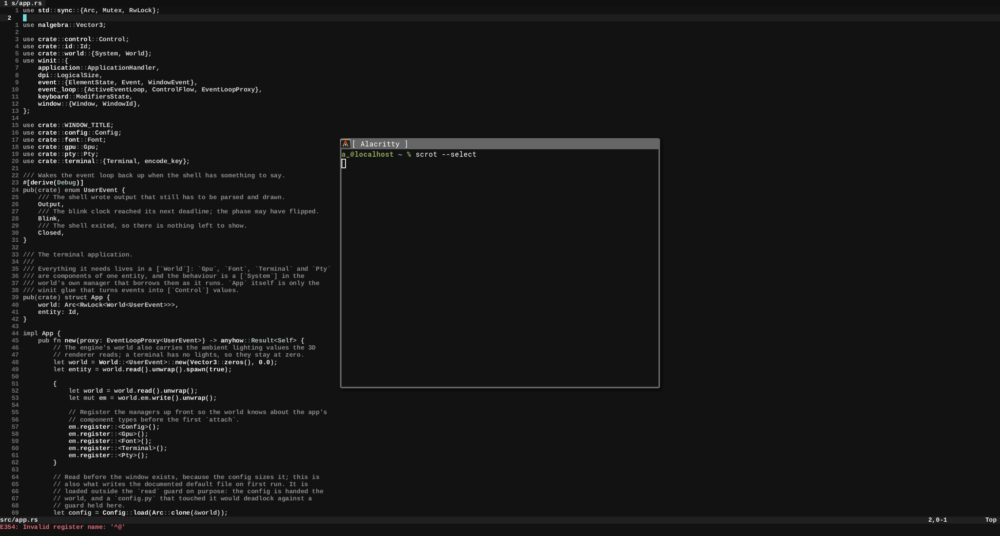
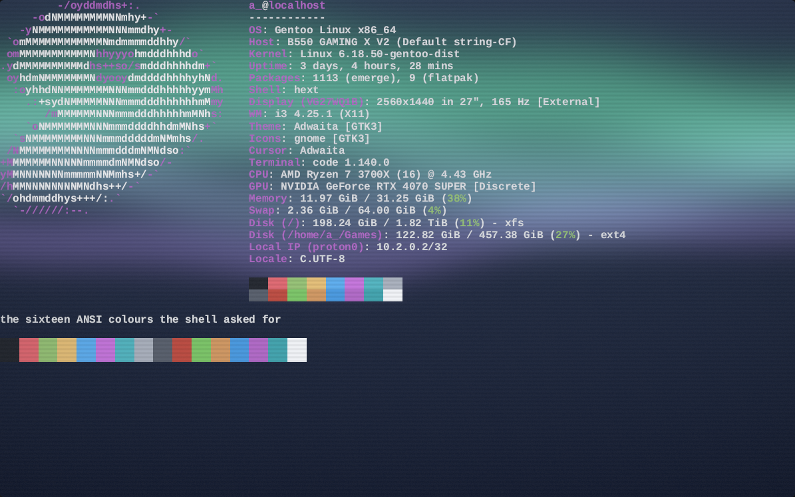
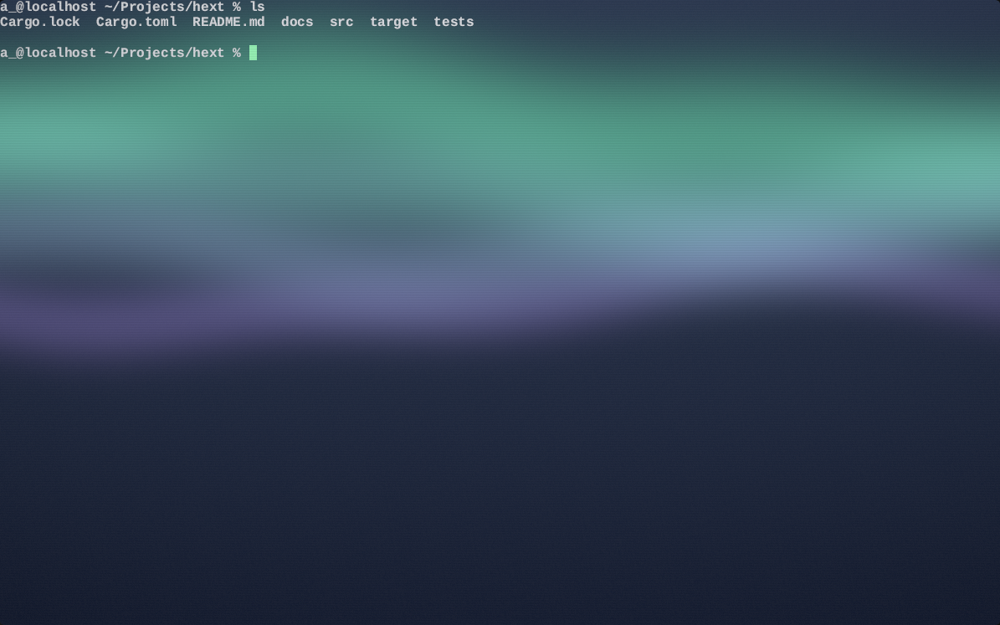
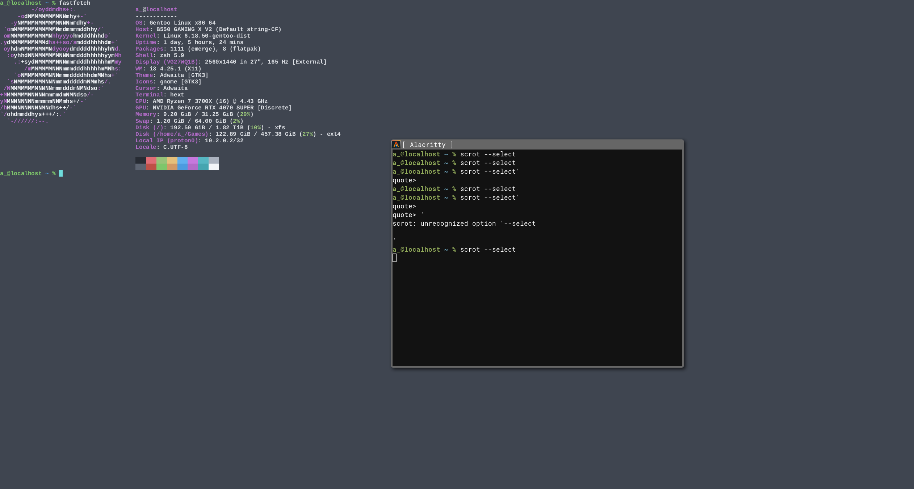

# hext

A GPU-rendered terminal emulator in Rust, built on `winit` and `wgpu`.

The grid is drawn on the CPU into a texture and composited on the GPU, and the
look is a Python file: colours, the shader the screen is drawn with, and the two
pictures that can go behind and in front of it.

hext is moddable. The configuration file is Python, evaluated by an embedded
interpreter and re-read whenever it changes, so the look and the behaviour are
both something a user edits rather than something baked into the binary: the
colours and the shader, the pictures behind and in front of the grid, systems that
shape the running app on every event, and render functions that run once per frame
with the frame about to be drawn — the terminal itself included, so a config can
animate it. Nothing above the shell needs a rebuild *or a restart* to change — see
[Configuration](#configuration).

```sh
cargo run   # the terminal
cargo test  # unit and shader tests
```

## Screenshots

hext in motion: `fastfetch`, a listing, and then `htop` on top of it — the
block-art logo, the colour swatch and the TUI are all drawn from the grid the
shell wrote.


Neovim open on `src/app.rs`, running inside hext:



`fastfetch`, and the 16 ANSI colours a shell script asked for:



A fresh prompt, the window filled by the configured background:



The colour swatch again, from a later capture:



## Current behavior

- Spawns a shell on a PTY — `$SHELL`, or the program named in the config — and
  renders what it prints: this is a shell-connected terminal emulator, not just a
  text widget.
- Parses the shell's byte stream with a VT state machine (`vte`) into a character
  grid: `CR`, `LF`, `BS`, `TAB`, erasing, cursor movement, scrolling inside the
  margins `DECSTBM` sets, inserting and deleting characters and lines, tab stops,
  and saving and restoring the cursor all work.
- Paints colour the way the shell asks for it: the 16 ANSI colours, the
  256-colour cube and its greys, and 24-bit truecolour, for foreground and
  background, with bold, dim, hidden, inverse, underline and strikethrough
  resolved as each cell is drawn.
- Draws the rest of the text decorations: a real italic and bold face out of the
  font family, the whole `SGR 4:n` set of underlines (straight, double, curly,
  dotted and dashed), `SGR 53` overlines, and an underline colour of its own
  with `SGR 58` — so Neovim gets the undercurls its diagnostics use.
- Honours the modes a full-screen program sets: `DECAWM` (`CSI ? 7`), `DECOM`
  (`CSI ? 6`), `DECCKM` (`CSI ? 1`), `DECSCNM` (`CSI ? 5`), `DECSTBM`
  (`CSI top;bottom r`), `IRM` (`CSI 4`) and `RIS` (`ESC c`) all change what the
  grid does, rather than being swallowed and ignored.
- Answers the questions a program asks the terminal: `DA` (`CSI c`) says what
  this is, `DSR 5` says it is there and `DSR 6` reports where the cursor is — so
  a full-screen program that measures the screen first gets an answer.
- Draws the characters whose whole job is to touch their neighbours out of the
  cell's own rectangle, so that they tile: the **Box Drawing** block
  (`U+2500`–`U+257F`, including the double lines, the rounded corners and the
  diagonals), the **Block Elements** (`U+2580`–`U+259F`, the quadrants and the
  three shades), **Braille Patterns** (`U+2800`–`U+28FF`), the horizontal
  **scan lines** (`U+23BA`–`U+23BD`), the first sixty **Symbols for Legacy
  Computing** sextants (`U+1FB00`–`U+1FB3B`) and the four **Powerline**
  separators (`U+E0B0`–`U+E0B3`). The DEC special graphics set (`ESC ( 0`) is
  built on top of them, so a program that never leaves ASCII can still draw a box.
- Blinks the cursor and any cell the shell marked with `SGR 5`, on a 500 ms
  clock that stops while the window is not focused and restarts on a keystroke,
  so the cursor never vanishes from under the typing.
- Honours the cursor requests a program makes: `DECTCEM` (`CSI ? 25 h`/`l`) hides
  and shows it, and `DECSCUSR` (`CSI Ps SP q`) picks the block, bar or underline
  shape and whether it blinks — so Vim and Neovim get a block in normal mode, a
  thin bar in insert mode and an underline in replace mode. A block cursor keeps
  the character it covers readable: the block takes the cursor's colour where the
  cell is background and the screen's own colour where the ink is, the way an
  inverse-video cursor does. The bar and the underline are thin marks that sit
  over the character, so they are drawn solid.
- Selects text with the mouse: dragging the left button over the grid marks the
  cells it sweeps, in reading order, and draws them in inverse video — a band of
  the foreground colour with the text inside it in the background colour, which
  is what reads over a background picture too. `Ctrl+Shift+C` copies it to the
  system clipboard, with each line cut at its last non-blank cell, and that key
  does not go on to the shell. A click anywhere starts a new selection, and
  resizing the window gives it up, because the text has moved.
- Forwards keystrokes to the shell: arrows, Home/End, Insert/Delete, PageUp/Down,
  F1–F12, `Shift`+`Tab` as back-tab, `Ctrl`+letter as control codes, `Alt`+key as
  an `ESC` prefix, and the `CSI 1;n` modifier encoding for everything a modifier
  is held down with — in the `ESC O` spelling for the cursor keys while `DECCKM`
  is on.
- The shell's own echo is the only thing drawn, so there is no double echo and
  the screen always agrees with the shell's idea of the current line.
- Reads from the PTY happen on a dedicated thread that wakes the event loop
  through a user event, so a quiet shell never blocks the UI.
- Resizes the PTY (`SIGWINCH`) to match the grid, and recomputes the grid from the
  window dimensions and font metrics on every redraw.
- Closes the window when the shell exits.
- Holds its own resources — the GPU, the font, the grid, the shell and the
  clipboard — as components of one entity in an entity-component world, and
  handles events in a system that borrows them back out of that world.
- Finishes every frame with a `Drawable` — the screen pipeline, its bind group
  and the uniform the shader reads — which first runs the world's render
  pipeline, so the systems a config file registered can shape the frame that is
  about to be drawn.
- Lets the config file add systems of its own, so Python can shape the running
  app rather than only fill in settings, and re-reads the file when it changes, so
  the colours, the shader, the pictures and what Python does are all an edit and a
  save rather than a restart.
- Can draw a frame every frame when the config asks for it (`animate = True`),
  which is what a shader with a clock in it needs — the uniform it reads ends with
  `time`, seconds since the app started — and pauses that when the window is in
  the background, so a buried terminal costs nothing.
- Hands a render function the terminal itself (`world.terminal()`), so a config
  can read where the cursor is and how big the grid is, and animate the window and
  cursor colours from Python as well as from a shader.
- Draws the screen as ink over a backdrop: the screen texture carries how much of
  each pixel the grid covers in its alpha, so a picture named by
  `background_image` shows through every cell a program left unpainted, and a
  cell that asked for a colour of its own covers it.
- Puts a second picture over all of it: `foreground_image` is drawn last, over
  the text, the selection and the cursor, which is where the glass of a CRT — a
  shadow mask, a grille, a glare — belongs.

Not implemented yet: wide (CJK) double-width cells, scrollback, the alternate
screen, mouse reporting, and the second half of the Symbols for Legacy Computing
block (the wedges and one-eighth blocks after `U+1FB3B`), and the rounded and
half-height Powerline wedges (`U+E0B4` onwards). The colours of the 16 ANSI
palette are not settings yet either: a theme grades the colours a cell asks for
in its shader, rather than replacing the palette the grid is painted with.

## Configuration

On first run the app writes a `config.py` into the config directory —
`$XDG_CONFIG_HOME/hext/config.py`, or `~/.config/hext/config.py` when
`XDG_CONFIG_HOME` is unset — and evaluates it with an embedded Python interpreter
(`pyo3`), so the file is Python and a value can be computed rather than written
out; a file that cannot be evaluated is reported instead of stopping the
terminal.

The file is watched while the app runs: save it and the change lands on the
running terminal, with no restart and no rebuild. A setting of the wrong type, a
picture that cannot be read, or a shader that does not compile is reported and
that one setting keeps its default.

These are the names the file documents:

| Setting | Meaning |
| --- | --- |
| `font_size` | Size glyphs are rasterized at, in logical pixels |
| `window_width`, `window_height` | Size of a new window, in logical pixels |
| `shell` | Program to run inside the pty; `None` means `$SHELL` |
| `background`, `cursor_color` | Colours, as `(r, g, b)` floats in `0.0..=1.0` |
| `shader` | The WGSL the screen is drawn with, as source; `None` keeps the built-in one |
| `animate` | Draw a frame every frame, so a shader with a clock in it moves; `False` draws only on change |
| `background_image` | A PNG or JPEG to draw behind the grid; `None` keeps the `background` colour |
| `foreground_image` | A PNG or JPEG to draw over everything; `None` is no overlay |

Every one of them is read back: the colours and the two pictures are part of the
frame, the shader is the pipeline the frame is drawn with, `animate` decides
whether the loop keeps drawing, and the file is re-read when it is saved, so none
of it needs a rebuild. A window manager is free to override the requested window
size.

### Two examples

`docs/` holds two whole configs. Either can be copied over your own `config.py`,
and either can be saved again while hext is running:

- `docs/config-aurora.py` — a night sky with bands of light drifting across it,
  a vignette, scanlines, and a render function that walks the cursor colour
  through the same greens as the sky. The example of animation from both sides at
  once: the shader's clock and Python.
- `docs/config-neon.py` — a synthwave sunset: a sliced sun, a floor grid marching
  towards the viewer, stars, a slow flicker, and the shell's own colours graded
  into the theme. The example of a *theme*.

A theme in hext is a shader plus the colours the config owns, and the shader is
the interesting half, because the grid carries the colours the shell asked for:
the only place to re-colour a terminal is after the cells are drawn.
`config-neon.py` does it by turning each cell's brightness into a walk through a
three-stop ramp — deep violet, cyan, hot pink — so `ls`, a diff and a status line
all come out in the theme. What survives the grade is brightness, and with it the
reading order of the text: the brightest colour the shell uses is still the
brightest thing on screen. The 16 ANSI colours are not settings, so a theme
grades them rather than replacing them.

Both examples are `animate = True`, and both are evaluated by `cargo test` with
their shaders validated, so the ones the repository ships are known to build.

### A picture behind the grid

`background_image` names a picture — `background_image = "/home/you/wall.png"`
— which is stretched over the window and drawn under the text. The screen texture
is ink rather than a picture: its alpha says how much of each pixel a cell covers,
so the picture shows through wherever a program left a cell unpainted.

That means a full-screen program which paints its own background covers the
picture, and Neovim does exactly that by default: set `hi Normal guibg=NONE
ctermbg=NONE` (or `:set notermguicolors`) and its cells go back to the terminal's
ow colour. Highlighted regions, a status line, a `\x1b[41m` background — anything
that asked for a colour of its own — stay opaque on top of the picture.

A picture that cannot be read is reported and the `background` colour used
instead, the way a config file that cannot be evaluated keeps the defaults.

The picture's own alpha is part of the composite: it is drawn *over* the
`background` colour rather than in place of it, so a PNG with transparent parts
shows that colour through them — the shape, over the terminal's colour. An
alpha channel is not required: a picture without one simply covers the colour,
which is what a wallpaper does.

### A picture over the grid

`foreground_image` is the other side of the same idea: a picture stretched over
the window and drawn over *everything* — text, selection and cursor included.
Where it is transparent the screen shows through, so it is a PNG with an alpha
channel: a shadow mask, a grille, a sheet of glare, a scratch on the glass.

One overlay covers the whole window at once, so a mask is stretched rather than
repeated: at these cell sizes (about ten by eighteen pixels) a grille drawn at
one line every third source pixel comes out as a fine weave over the text, and
anything much stronger than a quarter of the way to black will eat into the
glyphs instead of tinting them.

An overlay has to be transparent somewhere to be an overlay at all, and the
decoder cannot invent that: a file with no alpha channel — a three-channel PNG,
or any JPEG — becomes opaque everywhere, and covers the screen instead of lying
over it. hext says so when it loads one. The screenshots in `docs/` are
three-channel, which is why they are pictures *of* the terminal rather than
masks for one:

### Custom shaders

`shader` holds WGSL source, so the whole look of the terminal can be changed from
the config file alone — a vignette, a scanline overlay, a colour grade, whatever
the fragment shader makes of the sampled texture:

```python
shader = """
@vertex
fn vs_screen(@builtin(vertex_index) index: u32) -> @builtin(position) vec4<f32> {
    ...
}
"""
```

The source needs the entry points and bindings the app draws with, because the
app does not know which ones it will find:

| Binding | What it is |
| --- | --- |
| `@group(0) @binding(0)` | A `Screen` uniform: `background`, `cursor_color`, `resolution`, `grid`, `cursor`, `cursor_visible`, `cursor_style`, `cursor_size`, and `time` — seconds since the app started, for a shader that moves |
| `@group(0) @binding(1)` | The screen texture: the grid as ink, in sRGB bytes, with the alpha saying how much of each pixel a cell covers |
| `@group(0) @binding(2)` | A sampler for that texture |
| `@group(0) @binding(3)` | The `background_image` picture, stretched over the window and composited by its own alpha over `background` — or one opaque pixel of `background` when the config named none |
| `@group(0) @binding(4)` | The `foreground_image` picture, stretched the same way — or one transparent pixel when the config named none |

`vs_screen` draws one fullscreen triangle from `@builtin(vertex_index)` and
`fs_screen` returns a colour for `@builtin(position)`. `src/render/shaders/screen.wgsl`
is the reference — and the shader `None` falls back to — so the usual way to write
one is to copy it and change what you like. Since the config is Python, a file can
be read instead of pasted:

```python
shader = open("/home/you/.config/hext/crt.wgsl").read()
```

Because the screen texture is ink rather than a finished picture, the one line a
shader usually has to start with is the composite:

```wgsl
let ink = textureSample(screen_tex, screen_sampler, uv);
let backdrop = textureSample(background_tex, screen_sampler, uv).rgb;
var color = mix(backdrop, ink.rgb, ink.a);
```

Effect shaders spread that line out — the aberration in the CRT config shifts the
texture sideways per channel, so the alpha comes from the unshifted sample and the
colour from the shifted ones. Anything that ignores the alpha shows the plain
`background` colour behind the text whatever `background_image` says. The overlay
is the last thing the reference shader does, so a shader that draws one puts it
after the cursor and after whatever else it did:

```wgsl
let glass = textureSample(foreground_tex, screen_sampler, uv);
color = mix(color, glass.rgb, glass.a);
```

`fs_screen` is also where the cursor is drawn: the uniform says which cell it is
in, what shape it has and whether it is shown at all. The reference shader draws
a block cursor with the character under it still readable, and leaves the bar and
the underline solid over the character. Anything that moves or spreads the ink by
a pixel or more is worth measuring against the built-in shader before keeping it:
a cell is only about ten by eighteen pixels, so a small amount of blur or colour
separation is the difference between tinted text and broken text.

Source that is present but not valid WGSL is reported and the built-in shader
used instead, so a typo in the config is a note rather than a terminal that will
not start — at startup, and again on every reload. It is checked with the same
WGSL front end (`naga`) that wgpu compiles shaders with, before wgpu is asked for
the pipeline, because a validation failure there is fatal to the process. The
built-in shader is parsed and validated by `cargo test`.

### Animating

A shader that moves needs a clock and a reason to be drawn again. The clock is
`time` in the `Screen` uniform — seconds since the app started — and the reason is
`animate`:

```python
animate = True
```

With `animate = False` — the default — the app draws only when something changed:
a keystroke, output from the shell, the blink clock. A quiet terminal costs
nothing, which is what makes it a terminal rather than a demo. With `animate =
True` the app asks for a frame as soon as the loop goes idle, so the shader sees
the time advance; presenting still paces the frames to the display, so it draws at
the refresh rate and not faster. Nothing is drawn while the window is in the
background, so an animation pauses there rather than running unseen.

`animate` is a setting the file can change while the app runs, so the clock only
has to tick when the shader that reads it is loaded:

```wgsl
fn sky(uv: vec2<f32>, time: f32) -> vec3<f32> {
    return 0.5 + 0.5 * sin(uv.x * 6.0 + time);
}
```

`docs/config-aurora.py` is a whole shader built on this: a night sky with bands
of light drifting across it, then the grid, then a vignette, scanlines and grain.

### Reloading

The file is read again whenever it changes on disk — checked a few times a second,
ot once per frame — and what it says is put into the running terminal:

```
hext: reloaded /home/you/.config/hext/config.py
```

The terminal's colours, the shader, the two pictures, the window size and
`animate` all follow the new file. A reload is also the one case that has to be
careful with code: the file is Python, so it can register systems, and a system
registered by the previous file would stack on top of the new one's. The systems
the config added are therefore taken back before it is evaluated again, so a
reloaded file replaces the last one's behaviour rather than adding to it. What it
did to the world — entities it spawned, values it set — stays: a reload is not a
rewind.

A file that cannot be evaluated is reported and the settings are left as they
were, so an edit in progress never takes the terminal down with it.

### The world

The file is also handed the application's `world`, so a config can shape the
running app rather than only fill in settings:

| Call | Meaning |
| --- | --- |
| `world.spawn(active=True)` | Adds an entity, returning its id |
| `world.despawn(entity)` | Removes an entity and its components |
| `world.entities()`, `world.entity_count()` | The active entities, and how many there are |
| `world.add_system(fn, pipeline=0)` | Registers `fn(world)`, called once per event |
| `world.add_system(fn, pipeline=render_pipeline)` | Registers a render function: called once per frame, while it is drawn |
| `world.remove_system(pipeline=0)` | Drops the most recently added system |
| `world.system_count()` | How many systems are registered |
| `world.terminal()` | The running terminal, or `None` before the app has built it |
| `world.ambient_color`, `world.ambient_intensity` | The global lighting base values |

It is the same object the app runs on, not a copy, so anything it changes is
visible immediately. A system is an ordinary function taking the world, and it
may touch the world it is given:

```python
def dim(world):
    world.ambient_intensity = min(1.0, world.ambient_intensity + 0.01)

world.add_system(dim)
```

Systems run on the event loop's thread, once per event the app dispatches. A
system added while they run joins the next event, not the one in progress.

### Render functions

A system added to the `render_pipeline` pipeline runs once per frame instead, at
the point the frame is finished: the `Drawable` in `src/render/drawable.rs` runs
that pipeline and then draws the screen over the image the frame cleared. It is
the same world and the same kind of function, so a config file can say what a
frame does:

```python
frames = 0

def draw(world):
    global frames
    frames += 1
    world.ambient_intensity = (frames % 120) / 120.0

world.add_system(draw, pipeline=render_pipeline)
```

A frame is not an event, so the render systems are handed `Event::AboutToWait` —
the event that says the loop has nothing left to do — which is exactly when a
frame is drawn. The frame is drawn with the world's lock free, and the terminal's
lock is not held across the render systems either, so a render function may read
and write the world the way any other system does.

### The terminal, from Python

A render function is also handed the terminal the frame is about to be drawn
from, through `world.terminal()`. That is a handle to the running terminal, not a
copy:

| Member | Meaning |
| --- | --- |
| `terminal.cursor` | Where the cursor is, `(column, row)` |
| `terminal.size` | The grid, `(columns, rows)` |
| `terminal.cursor_visible` | Whether the cursor is drawn at all |
| `terminal.cursor_style` | `0` block, `1` bar, `2` underline — what the shell asked for |
| `terminal.cursor_size` | One cell, `(width, height)` in physical pixels |
| `terminal.background` | The colour behind the grid, as `(r, g, b)` |
| `terminal.cursor_color` | The colour the cursor is drawn in, as `(r, g, b)` |

The cursor's own state belongs to the shell — it is what `DECTCEM` and `DECSCUSR`
set — so it is read-only. The two colours are the terminal's, and a frame reads
them from it, so writing them from a render function animates them:

```python
import math, time

started = time.monotonic()

def drift(world):
    terminal = world.terminal()
    if terminal is None:
        return
    terminal.cursor_color = (0.1, 0.9, 0.5 + 0.5 * math.sin(time.monotonic() - started))

world.add_system(drift, pipeline=render_pipeline)
```

A change made there lands on the next frame, because a frame's uniform is written
before its render functions run — one frame, which is not a difference an eye can
see. Animating this way needs `animate = True` as well, for the same reason a
shader clock does: without it there is no next frame to land on.

## Structure

| File | Responsibility |
| --- | --- |
| `src/main.rs` | Creates the event loop, its user-event channel, and the application |
| `src/app.rs` | The winit glue: turns events into `Control` values and runs them through the systems |
| `src/config.rs` | Writes and evaluates the Python `config.py` through `pyo3`, and watches it so an edit is picked up while the app runs |
| `src/pty.rs` | Allocates the PTY, spawns `$SHELL`, and pumps its output from a reader thread |
| `src/clipboard.rs` | The system clipboard a selection is copied to, held for the life of the app |
| `src/terminal/` | The grid and everything that fills it |
| `src/terminal/mod.rs` | The VT parser and character grid, key encoding, and the rasterizer that paints cells and glyphs into the screen texture, as ink on nothing |
| `src/terminal/glyphs.rs` | The characters the terminal draws itself, out of the cell's rectangle: box drawing, blocks, braille, sextants and the Powerline wedges |
| `src/terminal/font.rs` | Loads the system monospace family — regular, bold and italic — and answers rasterization requests |
| `src/render/` | Everything that draws |
| `src/render/mod.rs` | Groups the two and re-exports `Gpu` and `Drawable`; the only place that mentions wgpu |
| `src/render/gpu.rs` | Owns the window, the surface, the device and the drawable, and drives one frame |
| `src/render/drawable.rs` | The draw a frame ends with: the screen pipeline, the bind group, the uniform, the picture behind the grid, and the render systems a config file can add |
| `src/render/shaders/screen.wgsl` | Composites the grid over the background picture and draws the cursor overlay |
| `src/world/` | The entity-component world |
| `src/world/mod.rs` | The entity and system managers, the ambient values, and the pipeline numbers |
| `src/world/control.rs` | The event value a system is handed each turn, plus its `exit` flag |
| `src/world/id.rs` | The `Id` entity handle |

Data flows one way around the loop: keystrokes are encoded and written to the PTY,
the shell echoes and prints, the reader thread collects the bytes and wakes the
event loop, and the VT parser turns them into grid cells that `rasterize` uploads
as a texture.

## The world

The app's resources and its behaviour share one entity-component world, in this
same crate: there is no library target in between.

The app owns exactly one entity, to which `Gpu`, `Font`, `Terminal` and `Pty` are
attached. Its behaviour is a single `System` (`TerminalSystem` in `src/app.rs`)
handed `(Control, World)` for every event; it borrows the components it needs out
of the world instead of storing them. `World::spawn`, `attach`, `attach_value`,
`component` and friends exist so callers pass a world rather than an entity
manager plus every component.

The world holds its systems as well as its entities — `World::add_system` and
`World::systems` — so `App` is only the winit glue that hands each event to them.
Each system sits behind its own handle and the manager is cloned out before the
systems run, which is what lets one borrow the world back as it runs; the Python
systems registered from the config file do exactly that.

| Module | Notes |
| --- | --- |
| `world::World` | Entity and system managers, plus the global ambient lighting values |
| `world::{EntityManager, ComponentManager}` | Type-erased component storage behind `Arc<RwLock<C>>` |
| `world::{System, SystemManager}` | `init`/`update` units of behaviour, added in order and run from a snapshot; `update_pipeline` runs one pipeline on its own |
| `world::{EVENT_PIPELINE, RENDER_PIPELINE}` | The pipeline the events go to, and the one a frame runs |
| `world::Control` | The winit event plus an `exit` flag; a system sets `exit` to stop the loop |

The ambient values reach a renderer as `world::AmbientUniform`: a padding-free
`bytemuck::Pod` struct laid out for a `vec3` plus an `f32`, ready for
`Queue::write_buffer`.

## Requirements

- Rust edition 2024 toolchain.
- A GPU driver supported by `wgpu`.
- An installed monospace font, discovered through the system font database.
- A Python 3 installation with a shared `libpython`: the config file *is* Python,
  and `pyo3` embeds an interpreter to evaluate it. `pyo3` locates the interpreter
  through `python3` on `PATH` (or `PYO3_PYTHON`).

`cargo test` covers the grid, the world and the config, and validates the shader
without needing a GPU or a PTY. The config tests need a Python interpreter, the
tests that rasterize glyphs need a system monospace font, and the clipboard test
needs a session to talk to: it is skipped rather than failed when there is none,
which is also how the app itself treats a session with no clipboard — selecting
still works, and only the copy is missing.
